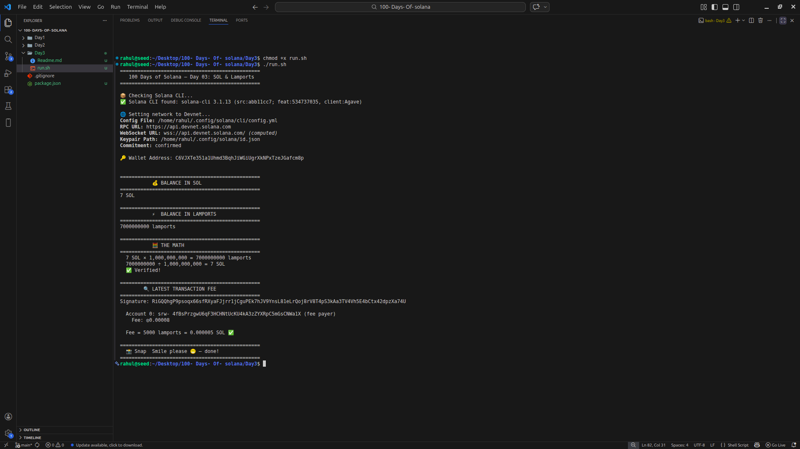

# Day 03 — Understand SOL and Lamports

> **100 Days of Solana** | MLH Global Hack Week

## 📸 Output Screenshot

<!-- Replace with your actual screenshot after running run.sh -->


---

## 🧠 What I Learned

- **SOL** is what users see. **Lamports** are what code uses.
- `1 SOL = 1,000,000,000 lamports` — always integers, never floats
- Named after **Leslie Lamport** — pioneer of distributed systems theory
- Floating point is unreliable for money → integer lamports guarantee exact results across all validators
- Every RPC call, fee, and program instruction uses **lamports**

## 🧮 The Math

```
2 SOL × 1,000,000,000 = 2,000,000,000 lamports
2,000,000,000 ÷ 1,000,000,000 = 2 SOL ✅
```

## 💡 Common Lamport Values

| Lamports    | SOL          | What it is               |
|-------------|--------------|--------------------------|
| 5,000       | 0.000005 SOL | Base transaction fee     |
| 890,880     | ~0.00089 SOL | Minimum token account rent |
| 1,000,000,000 | 1 SOL      | One SOL                  |
| 2,000,000,000 | 2 SOL      | Default devnet airdrop   |

## 🚀 Run It

```bash
chmod +x run.sh
./run.sh
```

> Script automatically checks CLI, sets devnet, airdrops if needed,
> shows SOL + lamport balance, verifies the math, and checks tx fee.

## 🛠️ Tech Used

- Solana CLI
- Solana Devnet
- Bash

## 📚 Resources

- [Solana Docs](https://solana.com/docs/intro/installation/dependencies)
- [Devnet Faucet](https://faucet.solana.com)
- [MLH Challenge](https://ghw.mlh.io/challenges)